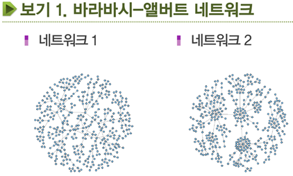
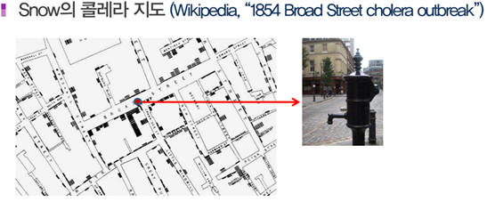
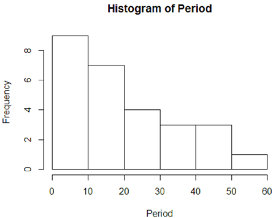

데이터시각화 1강
=========

### 데이터 시각화란 무엇인가?

### 1.1 데이터 시각화는 왜?
큰 규모의 데이터는전체 모습이 드러나지 않는데 시각화의 목표는 데이터의 통계적 정보를 그림의 형태로 드러내는데 있다.

**보기1. 바라바시-앨버트 네트워크**

사회 네트워크는 사회구성원간 관계로서, 구성원이 n명인 사회 네트워크는
n개의 행과 n개의 열의 행렬A로 표현될 수 있다. 여기서 행렬 A의 (i,j) 요소 Aij는
구성원 i와 j가 소통하는 관계이면 1이고 비소통 관계이면 0이다.

이같은 행렬 A에 대한 셀값 검색만으로는 사회 네트워크의 전체모습을 파악하기 어렵다.
행렬 A의 셀 수는 대각선 셀을 제외하더라도 모두 n(n-1)개로서 구성원 수 n이 커짐에 따라
n의 제곱에 따라 증가하기 때문이다. 예컨데 n=400 이면 네트워크 행렬 A의 비대각 셀 수는 1560개나 된다.

**보기2. 런던의 콜레라 지도**

1854년 8월 31일 영국 런던의 소호 지역에서 콜레라가 발생하였다. 
의학 연구자인 존 스노(John Snow)는 이를 의심하고 사망자의 수만큼 막대 선을 지도에 그려 넣었다.
그 결과 브로드(Broad Street)의 중앙에 막대 선들이 집중되는 경향을 볼 수 있었고 근처에 우물 펌프가 있었다.
콜레라균이 우물을 오염시켰고 그 물을 길어 마신 동네 주민들을 희생시킨 것이다. 이러한 의견이 받아들여져 우물이 폐쇄되었고 그 이후 콜레라는 확산되지 않았다.

이 사례에서 데이터는 사망자 리스트인데 단순집계표만으로는 콜레라가 물과 관련이 있음을 알아낼 수 없다. 스노의 콜레라 지도는 단순함에도 불구하고 역학에서 손꼽히는 역사적 발견으로 이어졌다.

### 1.2 시각화는 어떻게?

1. 데이터의 이해
2. 목표 설정
3. 그래프 선정
4. 소프트웨어의 활용(R)
5. 스토리텔링

###1.3 시각화의 도구 R
www.r-project.org

###1.4 R 시각화 사례

    kings <- read.table("chosun kings.txt", header=T)
    str(kings); attach(kings)
    windows(width=5.5, height=4.5)
    hist(Period)

###1.5 R의 컬러 체계

